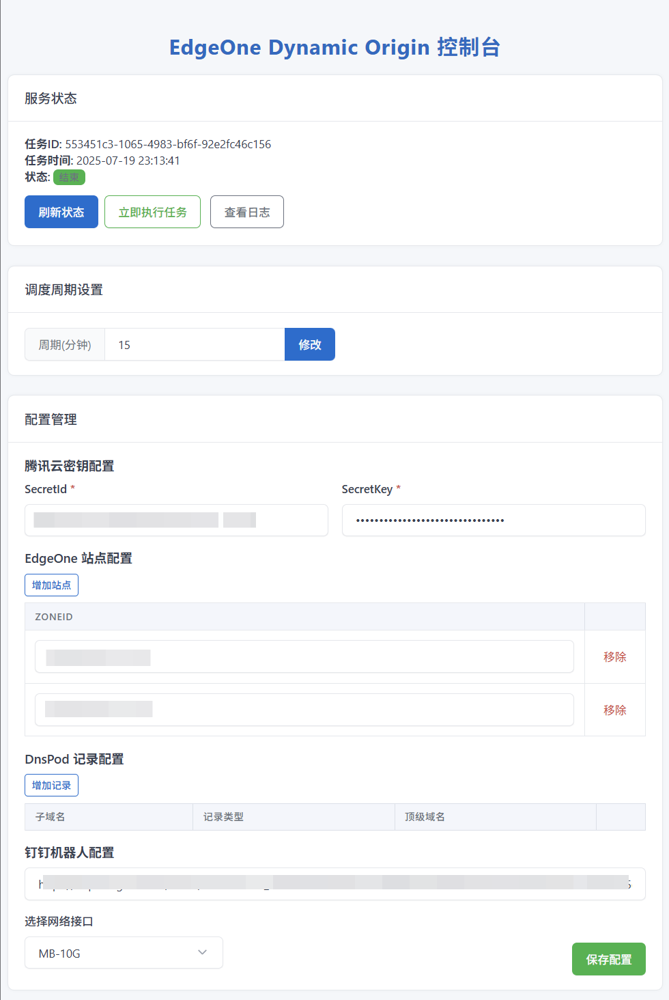

# EdgeOne Dynamic Origin

EdgeOne 是腾讯云的边缘安全加速平台。该脚本为其提供动态更新源站组 IP 的功能。
此功能特别适用于那些 IP 地址可能会变化的源站，确保 CDN 始终能够正确地获取最新的内容。比如仅有动态 IPV6 地址的服务器，
也能够长期稳定部署WEB服务，而不必使用 frp / ngork 等内网端口转发工具。

注意，若要使用该脚本，在 EdgeOne 中的加速域名必须使用源站组配置源站。

### 使用方法

#### windows
1. 安装 `pip install eodo`
2. 运行 `eodo -p 54321`以启动。 -p 54321 表示 web 管理界面监听端口为 54321。
3. 在 `http://localhost:54321` 中配置必要的配置项。

#### ubuntu
1. 安装 `pip3 install eodo -U --break-system-packages`
2. 运行 `export PATH="$HOME/.local/bin:$PATH" && source ~/.bashrc` 将 ~/.local/bin 加入 PATH
3. 运行 `eodo -p 54321`以启动。  -p 54321 表示 web 管理界面监听端口为 54321。
4. 在 `http://localhost:54321` 中配置必要的配置项。

#### Docker
1. 构建镜像：
   ```bash
   docker build -t eodo:latest .
   ```
2. 运行容器：
   ```bash
   docker run -d -p 54321:54321 --name eodo eodo:latest
   ```
3. 浏览器访问 `http://localhost:54321` 进行配置。

### WEB 界面


#### 说明

持久化运行可用 nssm 或 systemd 配置服务。
